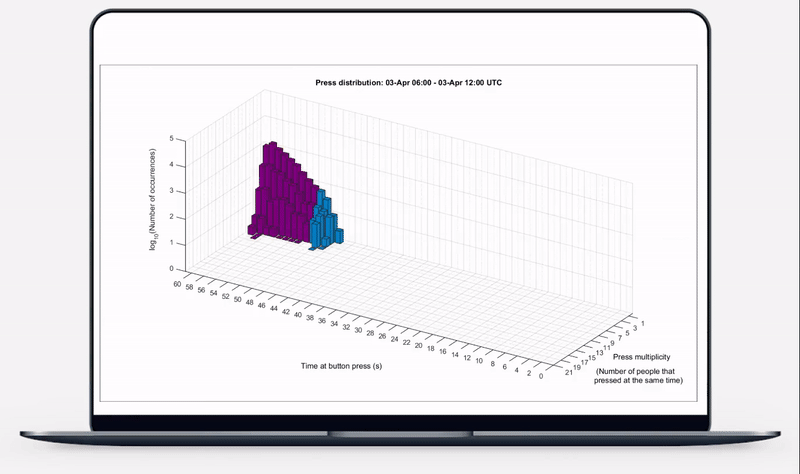
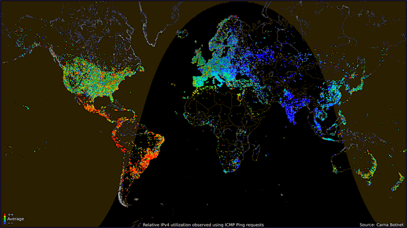

class: center, middle, animated slideInRight fadeOutLeft, animated slideInRight fadeOutLeft


```{r setup, include=FALSE}

knitr::opts_chunk$set(echo = TRUE, message = FALSE,
                      warning = FALSE)

```


# Trajetória


---
# Filho de Agricultores

```{r, echo=FALSE, fig.align='center', out.width = '40%'}


```


---
# Ensino Público


```{r, echo=FALSE, fig.align='center', out.width = '80%'}


```


---
# Universidades Federais

```{r, echo=FALSE, fig.align='center', out.width = '60%'}
knitr::include_graphics('universidade.gif')
```


---

# Profissões 

```{r, echo=FALSE, fig.align='center', out.width = '60%'}


```

---
class: center, middle, animated slideInRight fadeOutLeft, animated slideInRight fadeOutLeft

# Ciência de Dados

---
# Por que usar ciência de dados?

```{r, echo=FALSE, fig.align='center', out.width = '80%'}


```


---

# Quem usa ciência de dados?


```{r, echo=FALSE, fig.align='center', out.width = '80%'}


```


---
# O que precisa saber?

```{r, echo=FALSE, fig.align='center', out.width = '80%'}


```


---
class: center, middle, animated slideInRight fadeOutLeft, animated slideInRight fadeOutLeft

# Futuro

---

.pull-left[


```{r, echo=FALSE, fig.align='center', out.width = '80%'}


```


```{r, echo=FALSE, fig.align='center', out.width = '90%'}
knitr::include_graphics('microsoft.gif')
```


]


.pull-right[

```{r, echo=FALSE, fig.align='center', out.width = '90%'}

knitr::include_graphics('google.gif')

```


```{r, echo=FALSE, fig.align='center', out.width = '100%'}


```


]

---

# Metaverso

```{r, echo=FALSE, fig.align='center', out.width = '80%'}
knitr::include_graphics('mataverso_futuro.gif')
```
---

```{r, echo=FALSE, fig.align='center', out.width = '100%'}


```


